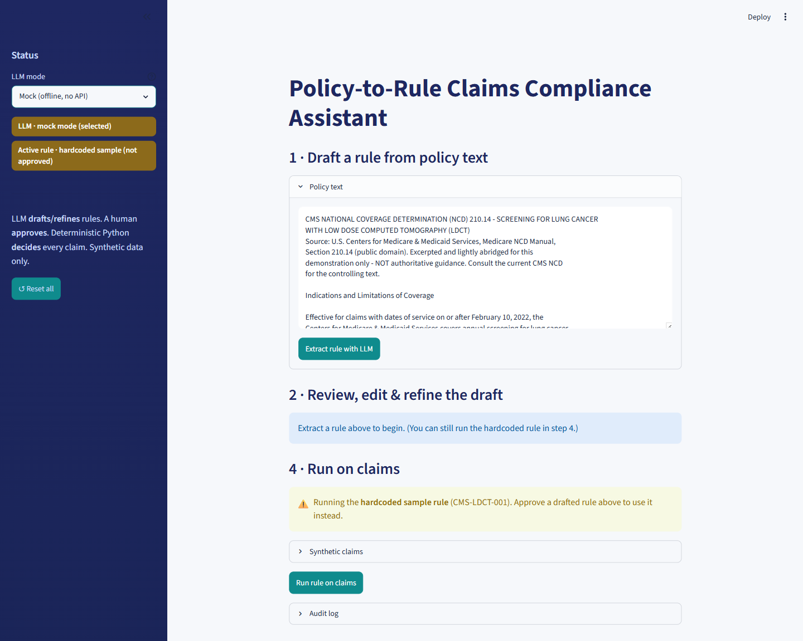
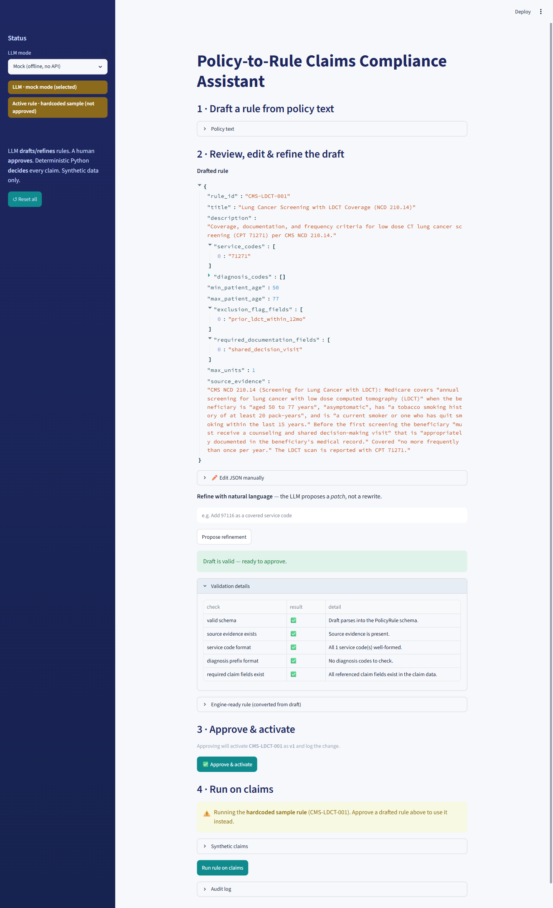
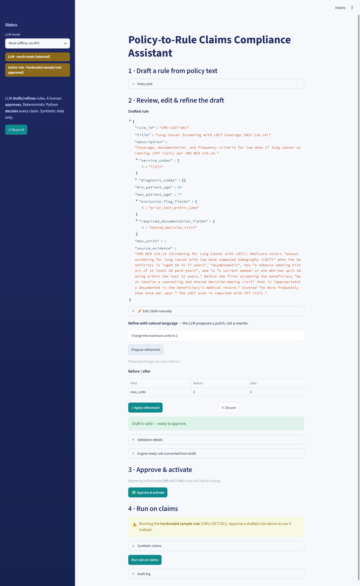
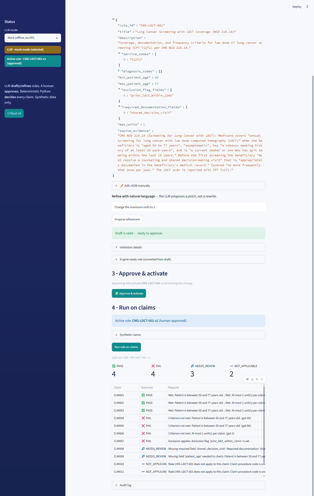
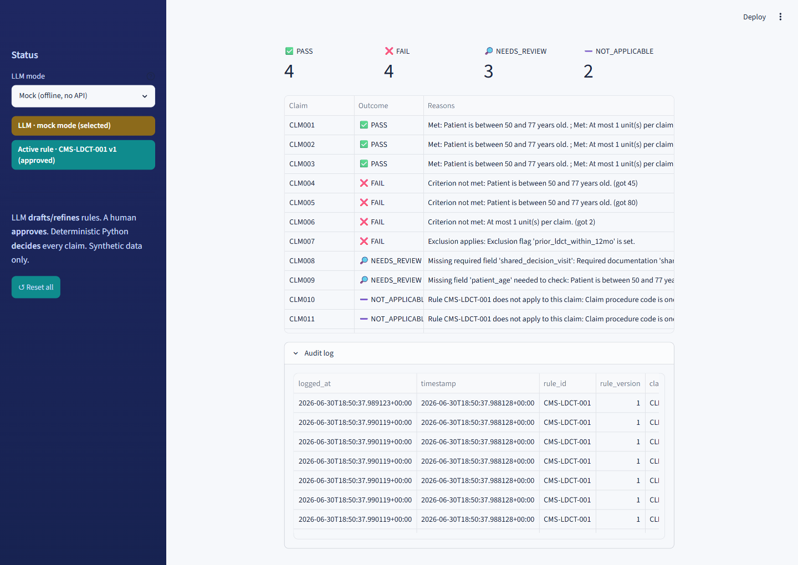

# Policy-to-Rule Claims Compliance Assistant

> Turn written healthcare policy into **executable, auditable claim-review rules** — where an
> LLM *drafts* the rule, a human *approves* it, and **deterministic code makes every decision.**

A proof-of-concept built for the Cotiviti AI/ML internship assessment
(*Content Management in Healthcare — converting written policy into executable claim rules*).

**Tech:** Python · Streamlit · Pydantic · Google Gemini (structured JSON output) · pandas · pytest
** Video link** : https://www.loom.com/share/91c14d50eb5848db85e2ce7e8791540c(https://www.loom.com/share/91c14d50eb5848db85e2ce7e8791540c)

---

## Why this matters

In FY2025, CMS reported an estimated **$28.83B** in Medicare (FFS) and **$37.39B** in Medicaid
improper payments — much of it tied to insufficient documentation or claims that didn't meet
program requirements.[^cms] The root problem: **policy is written in natural language for humans,
but claim systems need structured, testable, auditable logic.** Translating one into the other
is a slow, error-prone, expert-dependent bottleneck.

This project demonstrates a controlled way to close that gap with generative AI — **without
letting the model make payment decisions.**

## The core idea

The LLM is kept strictly in an *assistive* role:

- 🧠 **LLM drafts** a structured rule from policy text (and proposes plain-English revisions)
- ✅ **A human approves** every rule before it can run
- ⚙️ **Deterministic Python decides** every claim — with a plain-language reason and source evidence
- 📝 **Everything is audited** — every decision and rule change is logged

> The model never outputs a PASS/FAIL. It only proposes a rule object; the final verdict is
> made by deterministic, testable code.

## How it works

```
 Policy text
     │  (1) Gemini — structured JSON output
     ▼
 PolicyRule (draft) ──(2) Validator──► (3) Human approval ──► Active Rule
     ▲                                                            │
     │  (optional) NL revision: "Add G0297 as a covered code"     │  (4) Deterministic engine
     │            → structured RulePatch → before/after diff      ▼
     └───────────────────────────────────────────────  PASS / FAIL / NEEDS_REVIEW / N/A
                                                                  │
                                                                  ▼
                                                         Append-only audit log
```

1. **Draft** — Gemini converts policy text into a structured `PolicyRule` via JSON schema output.
   *(A deterministic **mock mode** runs the whole app with no API key.)*
2. **Validate** — checks the draft for: valid schema, present source evidence, well-formed
   CPT/HCPCS service codes, valid ICD-10 diagnosis codes, and that every referenced field
   exists in the claim data.
3. **Approve** — a reviewer activates a valid draft (and bumps its version). Until then the app
   runs a clearly-labeled hardcoded sample rule.
4. **Run** — the engine evaluates synthetic claims with a fixed, explainable precedence:
   missing scope field (e.g. no procedure code) → **NEEDS_REVIEW**, definitively out-of-scope →
   **NOT_APPLICABLE**, missing data → **NEEDS_REVIEW**, exclusion hit → **FAIL**, all criteria
   met → **PASS**.

### Natural-language rule revision
A reviewer can revise an approved rule in plain English — *"Add G0297 as a covered service
code"* or *"Change the maximum units to 2"*. The LLM returns a structured **`RulePatch`**
(a partial change, not a rewrite); the app applies it deterministically, re-validates, shows a
**before/after diff**, and saves it only on approval. **By design a patch can never alter the
rule's identity, its source policy evidence, the audit log, or prior results — and nothing
applies automatically.**

## Demo walkthrough

All screenshots are from the app running in **offline mock mode** — no API key or network needed.

**1 · Draft a rule from real policy text.** The input is a public-domain **CMS NCD 210.14**
(Lung Cancer Screening with LDCT) excerpt.



**2 · Structured draft + validation.** The LLM emits a Pydantic `PolicyRule`; the validator
checks schema, source evidence, CPT/ICD-10 formats, and that every referenced field exists in
the claim data — all green before approval is allowed.



**3 · Natural-language revision.** A reviewer types a plain-English instruction; the model
returns a structured *patch* (not a rewrite), shown as a **before/after diff** to apply or discard.



**4 · Deterministic decisions.** The approved rule runs over synthetic claims, producing an
explainable **PASS / FAIL / NEEDS_REVIEW / NOT_APPLICABLE** spread with a per-claim reason.



**5 · Append-only audit log.** Every decision is logged with rule id/version, timestamp,
outcome, reasons, and the **source-policy evidence** it rested on.



## Engineering highlights

- **Separation of concerns that enforces the thesis** — the decision engine has *no* LLM or UI
  imports, so it's deterministic and unit-testable in isolation.
- **Structured LLM output, not prompt-scraping** — the model is constrained to a Pydantic
  schema (`response_schema`), and a converter bridges the LLM-facing shape to the engine's shape.
- **Defense in depth** — schema validation + format checks + human approval gate the model's
  output before it can ever touch a claim.
- **Immutability guarantees by construction** — `RulePatch` simply has no fields for `rule_id`
  or `source_evidence`, and the apply step restores them, so provenance cannot drift.
- **Graceful degradation** — full offline mock mode means the app and the test suite need no
  network or API key.
- **Tested** — **32 passing tests** across the engine, validator, extractor, and patcher.

## Research direction

Beyond the working app, this POC is a vehicle for a research question:

> **Can a generative model safely accelerate the translation of natural-language healthcare
> policy into structured, auditable claim-review logic — without ceding decision authority to
> the model?**

The architecture here is a concrete hypothesis about *how* to do that: keep the LLM upstream as
a **drafting/revision assistant**, gate its output behind schema + format validation and a human
approval step, and make every final decision in deterministic, testable code with traceable
source evidence.

**How a fuller study would evaluate it:**
- **Extraction fidelity** — drafted rules vs. expert-authored gold rules (field-level
  precision/recall on codes, thresholds, and evidence spans).
- **Reviewer leverage** — time-to-approve and edits-per-rule vs. authoring from scratch.
- **Safety / catch-rate** — how reliably validation + approval reject malformed or ungrounded
  drafts, measured on adversarial/seeded-error policies.
- **Decision correctness** — engine outcomes against labelled synthetic claims, with error
  analysis across PASS / FAIL / NEEDS_REVIEW / NOT_APPLICABLE.

**What this POC already surfaced** (findings worth carrying into the report):
- **A codeable / clinical boundary.** A faithful extraction of NCD 210.14 leaves criteria like
  the ≥20 pack-year history *un-encodable* from claim fields — a useful signal about where rule
  automation stops and human/clinical judgment must take over.
- **Faithfulness vs. demonstrability tension.** The more strictly a rule mirrors the source
  policy, the fewer claims it auto-decides — arguing for evaluation on *real, code-rich* policies
  (e.g. LCDs with explicit ICD-10 indication lists), not just illustrative ones.
- **Evidence grounding matters.** Carrying a verbatim `source_evidence` span through to the
  audit log is what makes a drafted rule defensible; verifying that span actually appears in the
  policy text is a natural next guardrail.

**Future work:** real LCDs with ICD-10 indication groups, multi-rule policies, an automated
evidence-grounding check, and a gold-rule evaluation harness to put numbers on the questions above.

## Quickstart

```powershell
python -m venv .venv
.\.venv\Scripts\activate
pip install -r requirements.txt

# Run the test suite (offline, no API key needed)
python -m pytest -q          # -> 32 passed

# Launch the app
streamlit run app.py
```

In the UI: **Extract rule** → review validation → *(optionally)* **refine in natural language**
→ **Approve & activate** → **Run on claims**. Decisions and changes are written to
`audit_log.jsonl` — each claim line records the outcome, rule id/version, reasons, **and the
source-policy evidence** the decision rested on.

### Optional: use the real Gemini API
The app runs in **mock mode** out of the box. To use the live model:

```powershell
Copy-Item .env.example .env   # then set GEMINI_API_KEY=your_key
```

With a key present the extractor calls `gemini-2.5-flash`; without one it uses the deterministic
mock. (Get a key from Google AI Studio.)

## Project structure

```
app.py                       Streamlit UI (draft → refine → approve → run → audit)
src/
  schemas.py                 Pydantic models: Rule, PolicyRule, RulePatch, EvalResult
  llm_extractor.py           Gemini extractor (+ mock) and PolicyRule → Rule converter
  validator.py               Validation checks on the LLM draft
  rule_patcher.py            NL revision: propose / apply / diff a structured RulePatch
  rule_engine.py             Deterministic decision engine (no LLM, no UI)
  sample_rule.py             Hardcoded fallback rule (active until one is approved)
  audit_logger.py            Append-only JSONL audit log
data/
  sample_cms_policy.txt      Real CMS NCD 210.14 excerpt (extractor input; public domain)
  synthetic_claims.csv       Synthetic claims (no PHI)
docs/images/                 Screenshots used in this README
tests/                       pytest suite (engine, validator, extractor, patcher)
```

## Scope & disclaimer

This is a deliberately **simple, bounded proof of concept**. The policy input is a real,
public-domain **CMS NCD 210.14** (Lung Cancer Screening with LDCT) excerpt (abridged for
demonstration, not authoritative), while all claims are **synthetic** — no real PHI is used.
The design intent mirrors a realistic deployment: a human-reviewed, upstream **rule-drafting
assistant**, with all final claim decisions made by deterministic code.

Some of the policy's clinical eligibility criteria — e.g. the NCD's *≥20 pack-year smoking
history* and *quit-within-15-years* requirements — aren't codeable from the available claim
fields. By design the rule does **not** guess at them: per the NCD they're established and
recorded during the required, documented shared-decision-making visit, so the rule checks that
the visit is on file and defers that clinical judgment to human review — exactly the
*"LLM drafts, deterministic code + humans decide"* split this POC is built to demonstrate.

[^cms]: [CMS, Fiscal Year 2025 Improper Payments Fact Sheet](https://www.cms.gov/newsroom/fact-sheets/fiscal-year-2025-improper-payments-fact-sheet).
